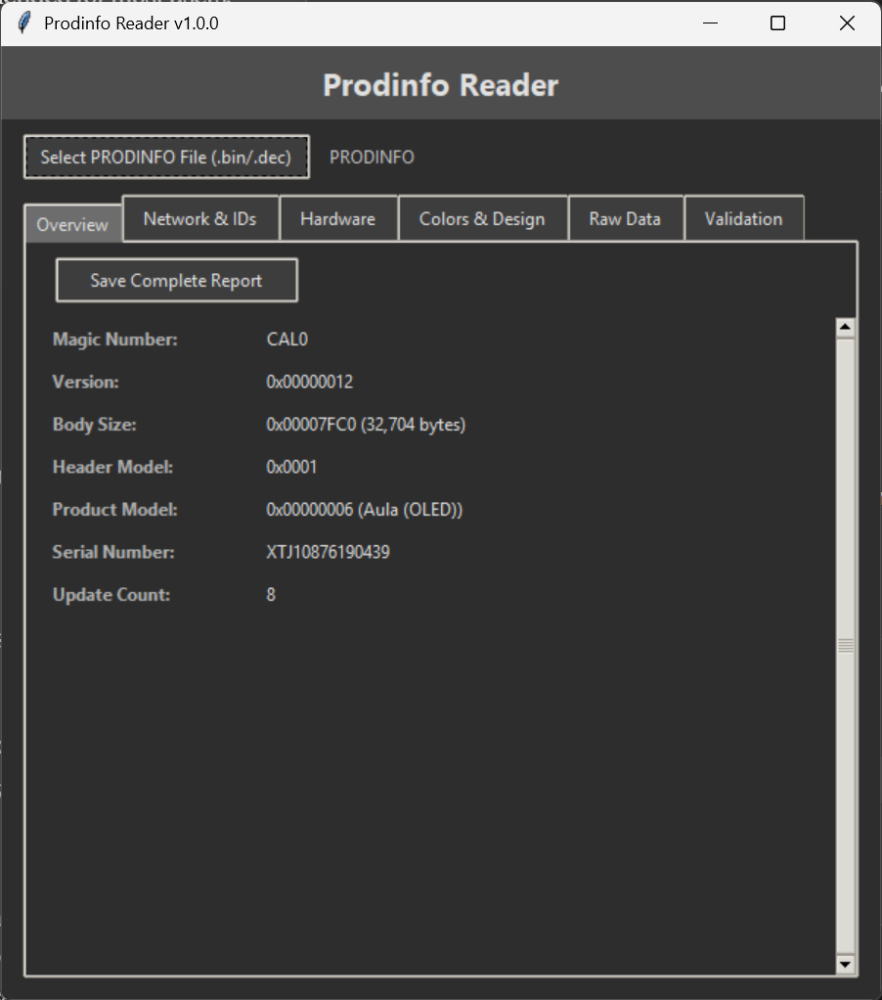

<div align="center">
  
</div>


# Nintendo Switch PRODINFO Analyzer

A GUI application for reading decrypted Nintendo Switch PRODINFO files and extracting console identification information.

## Overview

The Nintendo Switch PRODINFO Analyzer is a comprehensive tool that allows you to examine the internal calibration data of Nintendo Switch consoles. This application provides detailed information about your console's hardware components, network identifiers, color scheme, and validation status.

## Features

- **Multi-Tab Interface**: Organized display across 6 different tabs
- **Complete Hardware Analysis**: LCD vendor, battery info, analog sticks, sensors, and more
- **Network Information**: WLAN MAC, Bluetooth address, and region data
- **Color & Design Details**: Housing colors and design variations
- **File Validation**: Integrity checking with hash validation
- **Raw Data View**: Hex dump of the first 1024 bytes
- **Report Generation**: Save complete analysis as text report
- **Modern Dark Theme**: Professional grey color scheme


## Requirements

- Windows operating system
- No manual installations required - everything is handled automatically!

## Quick Start

**Super Easy Installation - Just One Click!**

1. **Download the application package**
2. **Run ProdinfoReader.exe**
   - The launcher will automatically install Python if not present
   - All dependencies will be installed silently in the background
   - The application will launch automatically once setup is complete

That's it! No manual Python installation, no dependency management, no command line needed.


## System Compatibility

- **Windows 7/8/10/11** (32-bit and 64-bit)
- **No administrator rights required** for basic operation
- **Portable**: Can run from any folder location


**Important**: Only **decrypted** PRODINFO files are supported. Encrypted files will be rejected.

## Usage

1. **Launch the Application**:
   - Simply double-click `ProdinfoReader.exe`
   - Wait for automatic setup to complete (first run only)
   - The analyzer will open automatically

2. **Select Your File**:
   - Click "Select PRODINFO File (.bin/.dec)"
   - Choose your decrypted PRODINFO file
   - The file must be properly named (see supported formats above)

3. **Analyze the Data**:
   - The application will automatically parse and display all information
   - Navigate between tabs to view different categories of data
   - Check the Validation tab for file integrity status

4. **Generate Report**:
   - Click "Save Complete Report" in the Overview tab
   - Choose location and filename for your report
   - Report will be saved as a formatted text file

## What Information is Extracted?

### Console Information
- Magic number and version
- Product model (V1, V2, Lite, OLED)
- Serial number
- Update count

### Network & Identification
- WLAN MAC address
- Bluetooth MAC address
- Region code
- Color variation codes

### Hardware Components
- LCD vendor and model (JDI, InnoLux, AUO, Sharp, Samsung)
- Battery information and lot number
- Analog stick types (Hosiden, FIT)
- 6-axis sensor details (LSM6DS3H, BMI160, ICM20600, etc.)
- Touch IC vendor information
- USB Type-C power specifications

### Design & Colors
- Housing color specifications
- Sub, bezel, and main color values
- RGB hex color codes

### File Validation
- Magic number verification
- Body size validation
- SHA256 hash verification
- Console type detection

## Security & Privacy

- **No Network Communication**: The application works entirely offline
- **No Data Collection**: No information is transmitted or stored externally
- **Local Processing Only**: All analysis is performed on your local machine
- **Read-Only Access**: The application only reads files, never modifies them

## Console Model Detection

The analyzer can identify the following Nintendo Switch models:

| Model ID | Console Type | Description |
|----------|--------------|-------------|
| 1 | Erista (V1) | Original Nintendo Switch |
| 2 | Copper | Development unit |
| 3 | Iowa (V2) | Revised Nintendo Switch |
| 4 | Hoag (Lite) | Nintendo Switch Lite |
| 5 | Calcio | Development unit |
| 6 | Aula (OLED) | Nintendo Switch OLED |

## Important Notes

- **Decrypted Files Only**: Encrypted PRODINFO files cannot be analyzed
- **Legal Use**: Only analyze PRODINFO files from consoles you own
- **Backup Recommended**: Keep backups of your original PRODINFO files
- **No Modification**: This tool is for analysis only, it cannot modify PRODINFO data

## Troubleshooting

### Launcher Issues
- **ProdinfoChecker.exe won't start**: Ensure you have an internet connection for first-time setup
- **Setup taking too long**: The launcher downloads Python and dependencies - this may take a few minutes on slower connections
- **Antivirus blocking**: Some antivirus software may flag the launcher - add an exception if needed

### Application Issues
- **"Invalid File" Error**: Ensure your file is named correctly (PRODINFO, PRODINFO.bin, or PRODINFO.dec)
- **"File Too Small" Error**: The PRODINFO file may be corrupted or incomplete
- **Validation Failures**: Hash mismatch may indicate file corruption or modification

### Performance Issues
- **Slow startup**: First run requires downloading Python - subsequent runs will be much faster
- **Application freezing**: Try restarting ProdinfoChecker.exe

### Manual Python Installation (Advanced Users Only)
If you prefer to install Python manually:
```bash
python3 ProdinfoReader.py
```
Note: The launcher method is recommended for most users.

## Report Format

Generated reports include:
- Complete console identification
- Hardware component listing
- Network configuration details
- Color scheme specifications  
- File validation results
- Analysis timestamp

Reports are saved as human-readable text files suitable for documentation or sharing.

## Contributing

Contributions are welcome! Please ensure:
- Code follows the existing style
- New features include appropriate documentation
- Testing is performed on various PRODINFO file types

## License

This project is provided as-is for educational and legitimate console analysis purposes. Please respect Nintendo's intellectual property and only analyze files from consoles you legally own.

## References

- [SwitchBrew Documentation](https://switchbrew.org/wiki/Calibration)
- Nintendo Switch Hardware Research Community
- Various homebrew development resources

---

**Disclaimer**: This tool is for educational and research purposes only. The authors are not responsible for any misuse or damage resulting from the use of this software.

---

**Disclaimer**: This tool is for educational and research purposes only. The authors are not responsible for any misuse or damage resulting from the use of this software.
